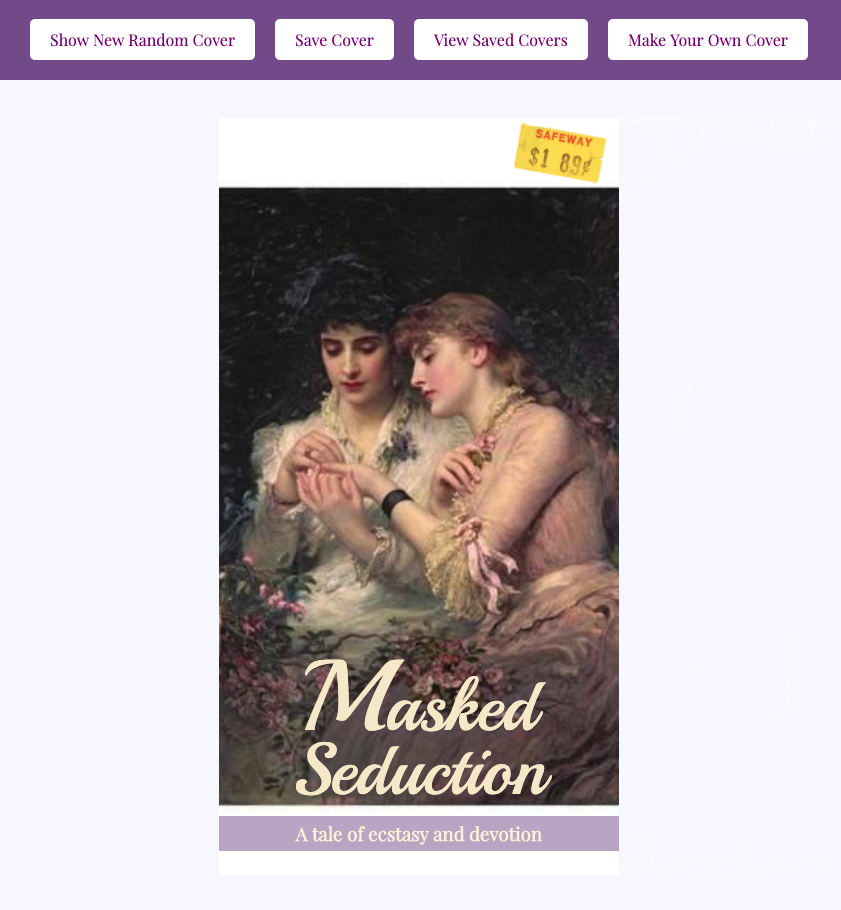
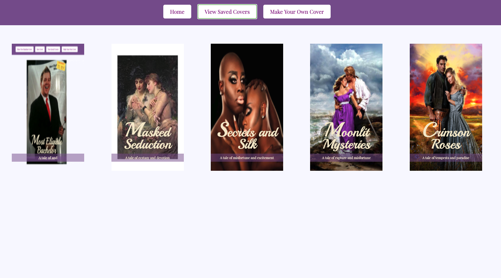
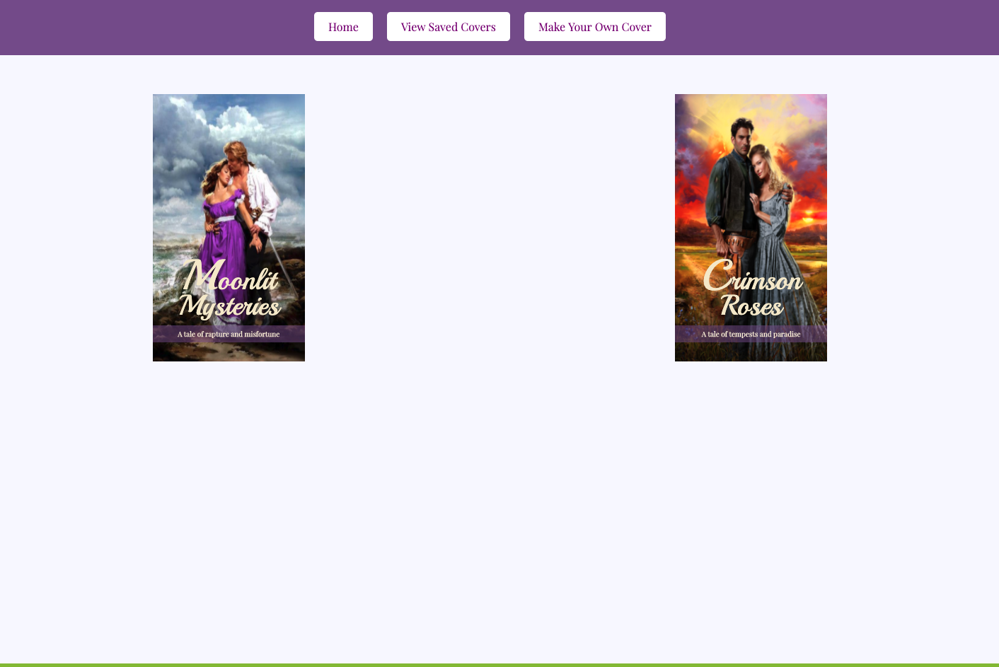

###Project Collaborators
Sarah Osgood: github.com/saraho1123
Amanda Davidson: githubcom/adavidson02

###GitHub Deployed Page
https://saraho1123.github.io/romcom/

###Turing Mod 1 RomCom Pair project
###August 2020

The goal of this project is to write clean, DRY JavaScript, to use and store data. For this project, the HTML and CSS files were provided to us, along with a Class, file with several arrays of data, and assets with images for our project.

Romance was in the air for this project! Well ... maybe on the screen ... the small screen! We were asked to write JavaSrcipt that would allow a user to display random covers, save covers they like, as well as create and save (if they chose) their own covers.

To highlight the main features of our project, we are inlcuding several screenshots.

Screenshot of a random cover:

Screenshot of a user generated cover:

Screenshot of saved covers:

Screenshot of several saved covers deleted with dblclick:

