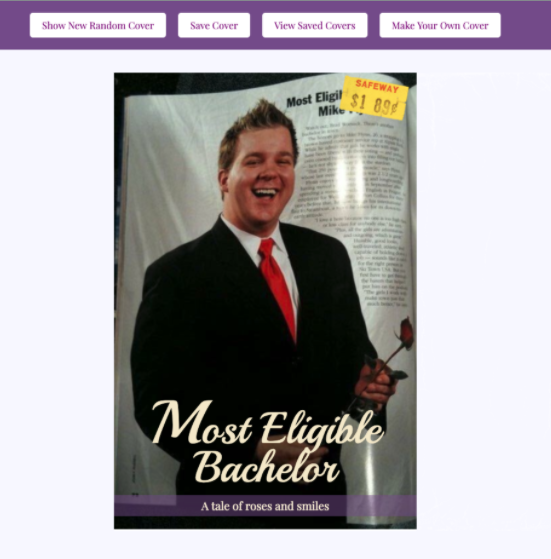

### Project Collaborators
Sarah Osgood: https://github.com/saraho1123
Amanda Davidson: https://github.com/ADavidson02

### GitHub Deployed Page
https://saraho1123.github.io/romcom/

### Turing Mod 1 RomCom Pair project
### August 2020

The goal of this project is to write clean, DRY JavaScript, to use and store data. For this project, the HTML and CSS files were provided to us, along with a Class, file with several arrays of data, and assets with images for our project.

Romance was in the air for this project! Well ... maybe on the screen ... the small screen! We were asked to write JavaScript that would allow a user to display random romance novel book covers, save book covers they like, as well as create and save (if they chose) their own covers.

We were able to complete functionality for all five iterations of the assigned project. Team work was important in completing this project along with some input from cohort mates and a Turing mentor.

 To highlight the main features of our project, we are including several screenshots.

Screenshot of a random cover:

Screenshot of a user generated cover:

Screenshot of saved covers:

Screenshot of several saved covers deleted with dblclick:

